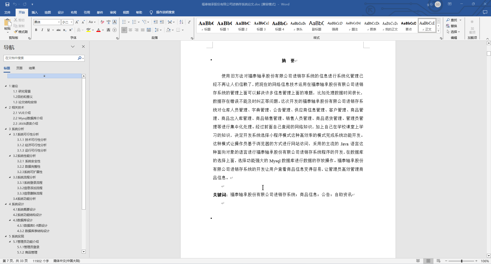
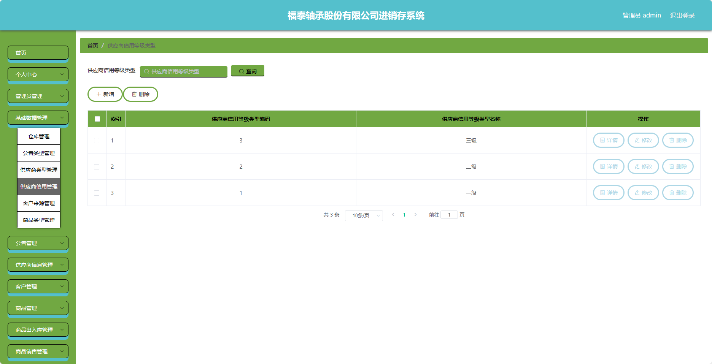
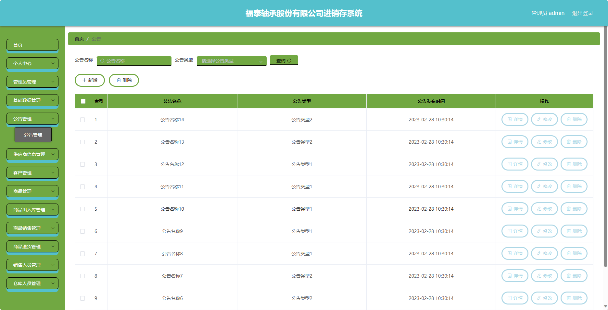
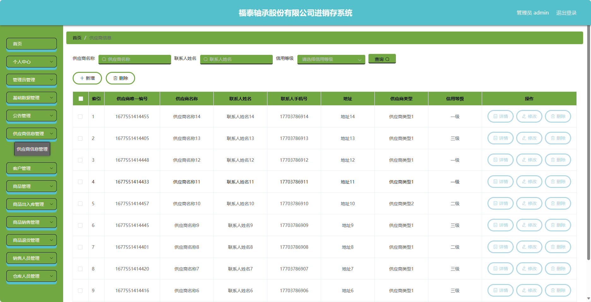
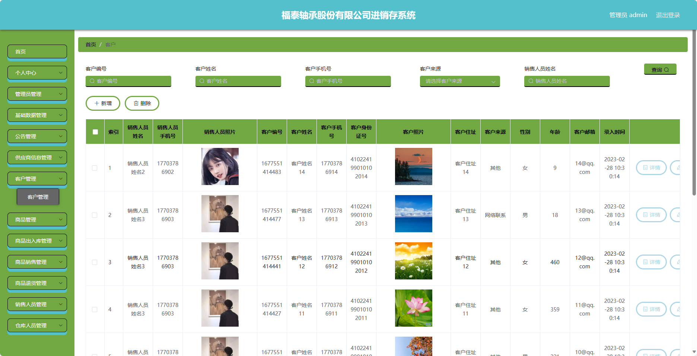
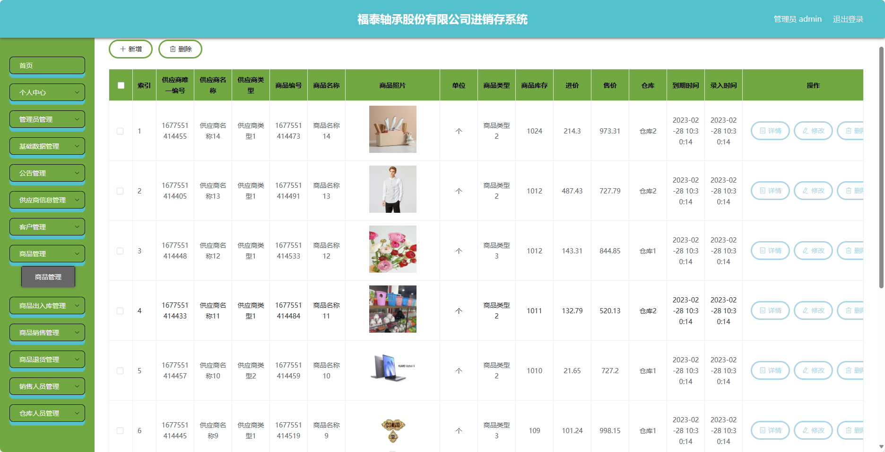
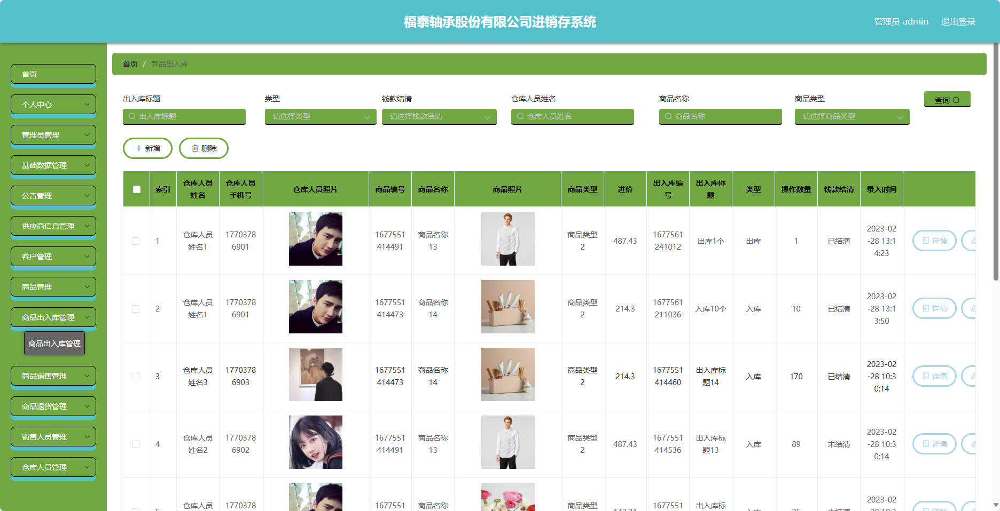
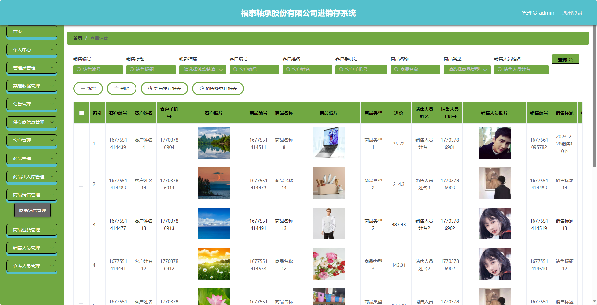
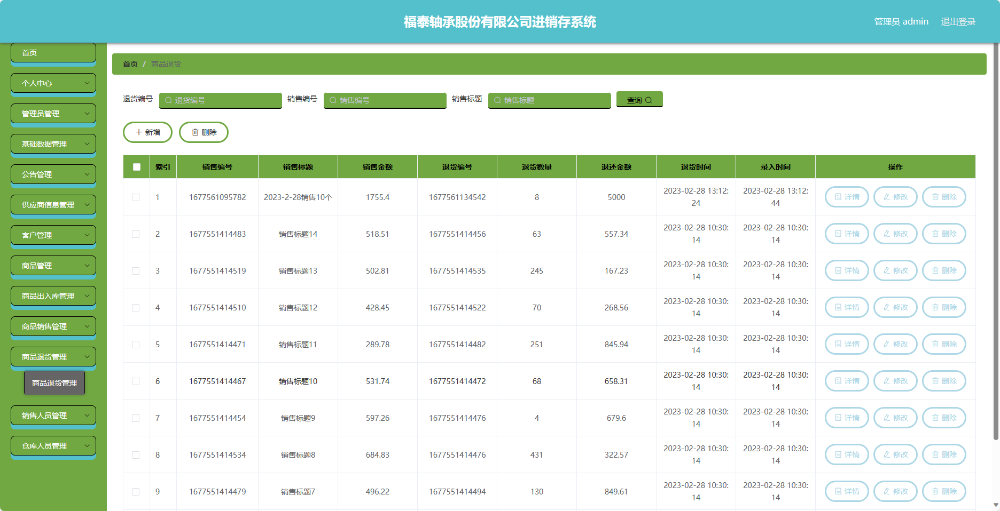

基于Springboot的福泰轴承股份有限公司进销存系统（程序+论文）
=
### 完整代码获取地址：从戎源码网 ([https://armycodes.com/](https://armycodes.com/))
### 作者微信：19941326836  QQ：952045282 
### 承接计算机毕业设计、Java毕业设计、Python毕业设计、深度学习、机器学习
### 选题+开题报告+任务书+程序定制+安装调试+论文+答辩ppt 一条龙服务
### 所有选题地址https://github.com/nature924/allProject

一、项目介绍
---
基于Spring Boot框架实现的福泰轴承股份有限公司进销存系统，系统包含三种角色：管理员、仓库人员、销售人员，主要功能如下。
### 管理员：
1. 个人中心：管理个人信息，包括修改密码、查看个人资料等。
2. 管理员管理：对其他管理员进行添加、编辑、删除等操作。
3. 基础数据管理：管理系统的基础数据，包括商品分类、供应商信息、客户信息等。
4. 公告管理：发布公司内部公告通知。
5. 供应商信息管理：管理供应商的信息，包括添加、编辑、删除供应商等操作。
6. 客户管理：管理客户信息，包括添加、编辑、删除客户等操作。
7. 商品管理：管理商品信息，包括添加、编辑、删除商品信息等操作。
8. 商品出入库管理：管理商品的出入库记录，包括入库、出库、调拨等操作。
9. 商品销售管理：管理商品的销售记录，包括销售订单管理、销售统计等。
10. 商品退货管理：处理客户退货请求，包括审核、退款等操作。
11. 销售人员管理：对销售人员进行添加、编辑、删除等操作。
12. 仓库人员管理：对仓库人员进行添加、编辑、删除等操作。

### 销售人员：
1. 个人中心：管理个人信息，包括修改密码、查看个人资料等。
2. 公告管理：查看公司内部公告通知。
3. 客户管理：管理客户信息，包括查看客户列表、添加新客户等操作。
4. 商品管理：查看商品信息，包括库存情况、价格等。
5. 商品销售管理：进行商品销售操作，包括录入销售订单、查询销售记录等。
6. 商品退货管理：处理客户退货请求，包括录入退货订单、处理退款等操作。

### 仓库人员：
1. 个人中心：管理个人信息，包括修改密码、查看个人资料等。
2. 公告管理：查看公司内部公告通知。
3. 商品管理：查看商品信息，包括库存情况、商品位置等。
4. 商品出入库管理：管理商品的出入库记录，包括入库、出库、调拨等操作。

二、项目技术
---
- 编程语言：Java
- 数据库：MySQL
- 项目管理工具：Maven
- 前端技术：VUE、HTML、Jquery、Bootstrap
- 后端技术：Spring、SpringMVC、MyBatis

三、运行环境
---
- 操作系统：Windows、macOS都可以
- JDK版本：JDK1.8以上都可以
- 开发工具：IDEA、Ecplise、Myecplise都可以
- 数据库: MySQL5.7以上都可以
- Tomcat：任意版本都可以
- Maven：任意版本都可以

四、运行截图
---
### 论文截图：

### 程序截图：

